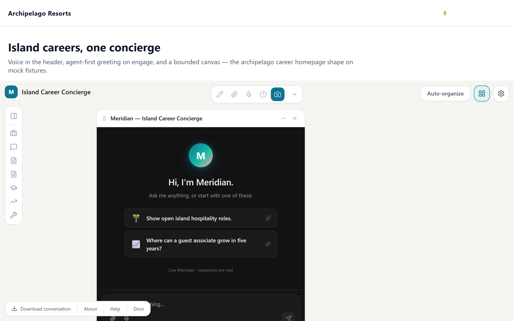
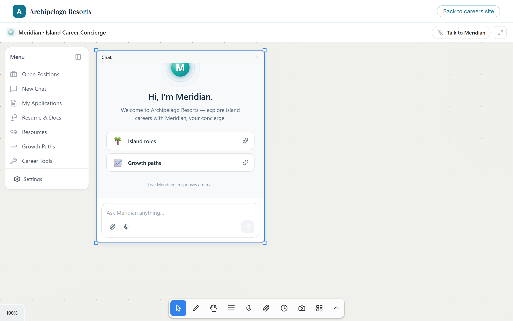
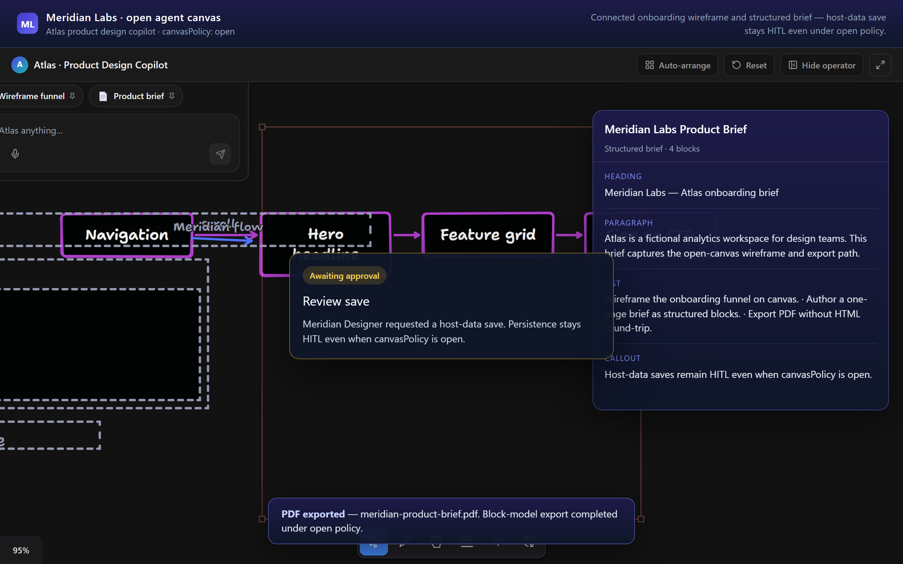
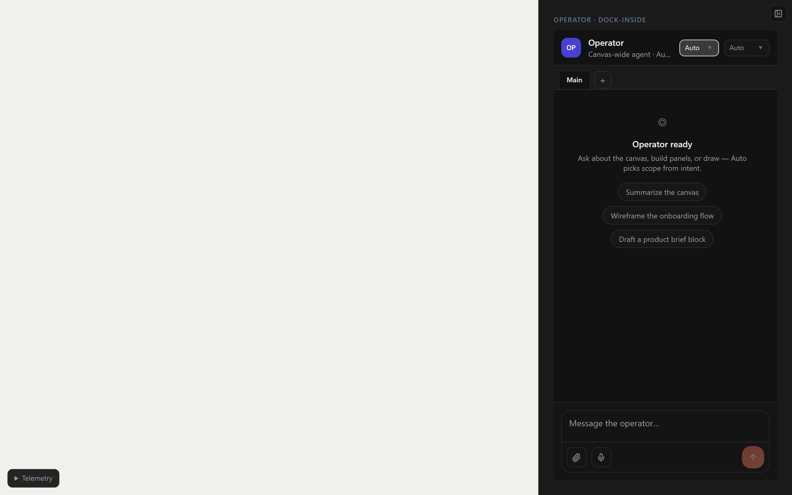

# agentable-canvas

Embeddable AI canvas: a chat panel, a draggable panel workspace, voice transport (Gemini Live), an optional tldraw whiteboard, and a Lit web component shell. Drop one tag into any page, whether it runs React 19, Vue, Angular, or plain HTML.

[](LICENSE)
[](https://www.npmjs.com/package/@mikehenken/agentable-canvas)

**Repository:** [mikehenken/agentable](https://github.com/mikehenken/agentable) (default branch: `main`)
**Live examples:** [agentable-examples.pages.dev](https://agentable-examples.pages.dev/)

## What it looks like

| Canvas, chat, and voice | Panel workspace |
|:---:|:---:|
| [](https://agentable-examples.pages.dev/examples/01-career-homepage/) | [](https://agentable-examples.pages.dev/examples/04-zero-js-marketing/career-canvas.html) |
| **tldraw whiteboard** | **Canvas-wide operator** |
| [](https://agentable-examples.pages.dev/examples/12-open-agent-canvas/) | [](https://agentable-examples.pages.dev/examples/13-canvas-wide-agent/) |

Every image links to its live example. The whole gallery is at [agentable-examples.pages.dev](https://agentable-examples.pages.dev/).

## Install

Published to npm as [`@mikehenken/agentable-canvas`](https://www.npmjs.com/package/@mikehenken/agentable-canvas):

```bash
npm install @mikehenken/agentable-canvas
```

No build step or npm account is needed for the script-tag embed below; it loads the prebuilt bundle straight from a CDN.

## Quick start

### Script tag (any HTML page)

Load the embed bundle over jsDelivr and place the element anywhere in the body. Works in vanilla HTML, WordPress, Vue, Angular, or any page that runs JavaScript.

```html
<script
  type="module"
  src="https://cdn.jsdelivr.net/npm/@mikehenken/agentable-canvas@latest/dist/embed/agentable-canvas.js"
></script>

<agentable-canvas
  tenant="your-tenant"
  primary-color="#3B82F6"
  welcome-message="Hi! How can I help?"
  voice-enabled
  style="width: 100%; height: 100vh; display: block;"
></agentable-canvas>
```

Hosts that cannot use ES modules can load `agentable-canvas.umd.js` with a plain `<script>` instead. Config can also be driven from a tenant endpoint (`config-url`, `anon-key`) and refreshed at runtime; see [EMBEDDING.md](EMBEDDING.md).

### React (npm)

```tsx
import { CanvasShell } from '@mikehenken/agentable-canvas/react-canvas';
import '@mikehenken/agentable-canvas/styles.css';

export default function Page() {
  return <CanvasShell config={{ tenant: 'my-co' }} />;
}
```

### Whiteboard host (e.g. landi-canvas-studio)

```tsx
import { LazyWhiteboardShell } from '@mikehenken/agentable-canvas/whiteboard';

<LazyWhiteboardShell config={{ tenant: 'my-co' }} tokenEndpoint="/api/mint-token" />
```

## Package exports

| Path | Surface |
|------|---------|
| `.` / `./react` | React wrapper over the Lit element |
| `./react-canvas` | Pure React `<CanvasShell>` (absolute-positioned panel workspace) |
| `./whiteboard` | tldraw infinite canvas + `PanelShape` panels |
| `./embed` | Lit `<agentable-canvas>` web component bundle |
| `./embed/voice-call-button` | Standalone voice-call widget |
| `./copilotkit-bridge` | AG-UI / CopilotKit protocol bridge |
| `./i18n` | Locale bootstrap and message catalog |
| `./styles.css` | Prebuilt Tailwind for React consumers |

Tenant brand voice is injected by the host, never baked into the OSS core.

## Documentation

| Topic | Link |
|-------|------|
| Embedding: theming, Shadow DOM, config attributes, reload | [EMBEDDING.md](EMBEDDING.md) |
| Install modes (script tag, npm, self-host) | [INSTALL.md](INSTALL.md) |
| Architecture (whiteboard, PanelShape, exports) | [docs/development/ARCHITECTURE.md](docs/development/ARCHITECTURE.md) |
| Release workflow | [docs/setup/RELEASE.md](docs/setup/RELEASE.md) |
| Branching (`main` only) | [docs/setup/BRANCHING.md](docs/setup/BRANCHING.md) |
| Changelog | [CHANGELOG.md](CHANGELOG.md) |
| Full index | [docs/DOCS_INDEX.md](docs/DOCS_INDEX.md) |

## Development

```bash
npm install
npm run dev          # Vite dev server
npm run lint
npm run typecheck
npm run test         # full release gate
npm run build
```

## Architecture (summary)

One package ships several surfaces from a single source of truth: `./react-canvas` (an absolute-positioned panel workspace), `./whiteboard` (a tldraw infinite canvas with `PanelShape` panels), and `./embed` (a self-contained Lit web component). The embed bundle is self-contained so it drops onto any host, and the tldraw-bearing embeds code-split their heavy vendors so a page that never opens a diagram or whiteboard does not download them. Details in [docs/development/ARCHITECTURE.md](docs/development/ARCHITECTURE.md).

## License

MIT. See [LICENSE](LICENSE).

## Contributing

1. Branch from `main`, open a PR into `main` ([branching guide](docs/setup/BRANCHING.md)).
2. CI must pass: lint, typecheck, the full test gate, and bundle budgets.
3. Releases are manual via GitHub Actions ([release guide](docs/setup/RELEASE.md)).

Issues and PRs: https://github.com/mikehenken/agentable
