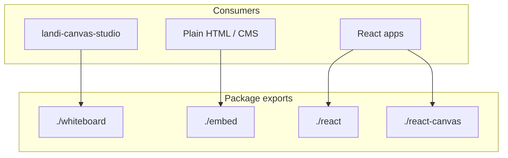

# Architecture Overview

`agentable-canvas` is an embeddable AI canvas library with three public export surfaces and two rendering substrates.

## Package exports

| Export path | Entry | Use case |
|-------------|-------|----------|
| `./whiteboard` | `src/whiteboard/index.tsx` | tldraw infinite canvas + `PanelShape` panels (landi-canvas-studio) |
| `./react` | `src/react/index.tsx` | React wrapper over Lit web component |
| `./react-canvas` | `src/react-canvas/index.tsx` | Pure React `<CanvasShell>` (no Shadow DOM) |
| `./embed` | `dist/embed/agentable-canvas.js` | Lit `<agentable-canvas>` for non-React hosts |



## Whiteboard substrate

`WhiteboardShell` (`src/whiteboard/WhiteboardShell.tsx`) mounts a full-viewport **tldraw** editor. Workspace panels (chat, open positions, resources, etc.) are not fixed DOM columns — they are **`PanelShape`** instances on the infinite canvas.

Default layout: `infinite-panels`. Legacy `split-column` remains for backward compatibility.

On editor mount:

1. `bindEditor(editor)` wires the imperative `panelShapeApi`
2. `openPanelInCanvas('chat', …)` opens the chat panel as a shape
3. `Tldraw` persists to IndexedDB via `persistenceKey`

## PanelShape

`PanelShape` (`src/whiteboard/shapes/PanelShape.tsx`) is a tldraw custom box shape:

- Extends `BaseBoxShapeUtil` for resize, selection, and bounds
- Renders React inside `HTMLContainer` (DOM escape hatch, not SVG)
- Stores `panelId`, `data`, and `minimized` in shape props
- `PanelChrome` handles title bar; body uses `pointerEvents: 'all'` so inputs work inside the canvas

Imperative API (`src/whiteboard/shapes/panelShapeApi.ts`):

| Function | Purpose |
|----------|---------|
| `openPanelInCanvas` | Spawn or focus a panel shape |
| `closePanelInCanvas` | Remove a panel shape |
| `focusPanelInCanvas` | Bring shape to front |
| `updatePanelProps` | Merge props into shape `data` |
| `bindEditor` / `unbindEditor` | Connect tldraw editor for non-React callers |

## Panel registry

`whiteboardPanelRegistry.ts` maps `panelId` → lazy React loader, mirroring the absolute-positioned canvas `panelImports.ts` model but feeding `PanelShapeUtil` instead of `<DraggablePanel>`.

```ts
export type WhiteboardPanelRegistry = Record<string, WhiteboardPanelLoader>;
export const DEFAULT_WHITEBOARD_PANEL_REGISTRY = { chat, 'open-positions', resources, 'growth-paths', ... };
```

Consumers pass a **stable module-scope** registry to `<WhiteboardShell registry={...}>`. `landi-canvas-studio` extends defaults in `src/lib/canvas-panel-registry.ts`.

Panel components receive `WhiteboardPanelProps`:

- `data` — shape-scoped props from `openPanelInCanvas`
- `hostedInWhiteboard` — signal to skip duplicate chrome

## Embed substrate (Lit)

`src/embed/agentable-canvas.ts` registers the `<agentable-canvas>` Lit element. It wraps the React canvas in Shadow DOM for style isolation. The embed path does **not** use the whiteboard barrel — it keeps the absolute-positioned panel workspace.

## Tenant configuration

Brand voice, persona, and panel data are **never** baked into the OSS core. Hosts inject config via:

- React: `<CanvasProvider config={...}>` / `<WhiteboardShell config={...}>`
- Lit: element attributes (`tenant`, `primary-color`, etc.)

## Related reading

- Root [README.md](../../README.md) — quick start and config tables
- [RELEASE.md](../setup/RELEASE.md) — version and consumer SHA pinning
- [BRANCHING.md](../setup/BRANCHING.md) — contribution flow
