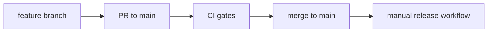

# Branching Strategy

## Canonical branch: `main`

| Branch | Status |
|--------|--------|
| `main` | **Canonical** — default branch, CI, releases |
| `master` | **Deprecated / removed** — historical orchestration pushed here; reconciled into `main` |

All new work targets **`main`**. Do not recreate `master`.

## Development flow



1. Branch from `main`: `git checkout -b feat/my-change main`
2. Open a pull request into **`main`**
3. CI (`.github/workflows/ci.yml`) runs lint, typecheck, and tests
4. Merge after review and green CI
5. Release via [RELEASE.md](RELEASE.md) when ready to publish

## Remote setup

```bash
git remote add public https://github.com/mikehenken/agentable.git
git fetch public
git checkout main
git pull public main
```

## Branch protection

`main` should be protected (require PR, require CI). On **GitHub Free** private repos, branch protection rules may return **403 Forbidden**. If so, enforce the same policy by convention:

- No direct pushes to `main` except the release bot commit
- All changes via PR with green CI

Document any waiver in repo issues if protection cannot be enabled.

## Historical note

Prior orchestration sessions pushed whiteboard work to `master` while GitHub's default was `main`. Reconciliation fast-forwarded `main` to include all `master` commits, then deleted `master` on the remote.
